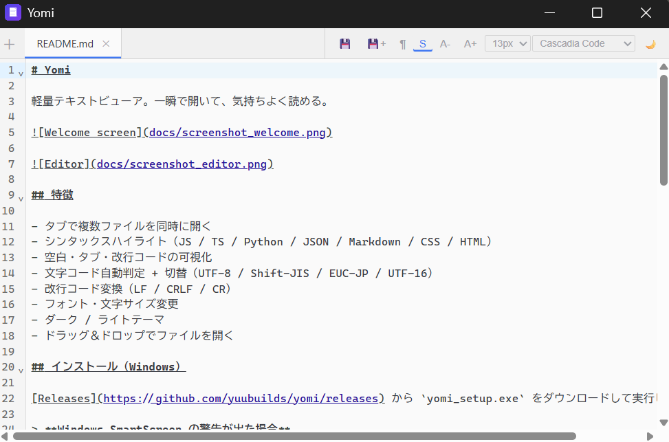
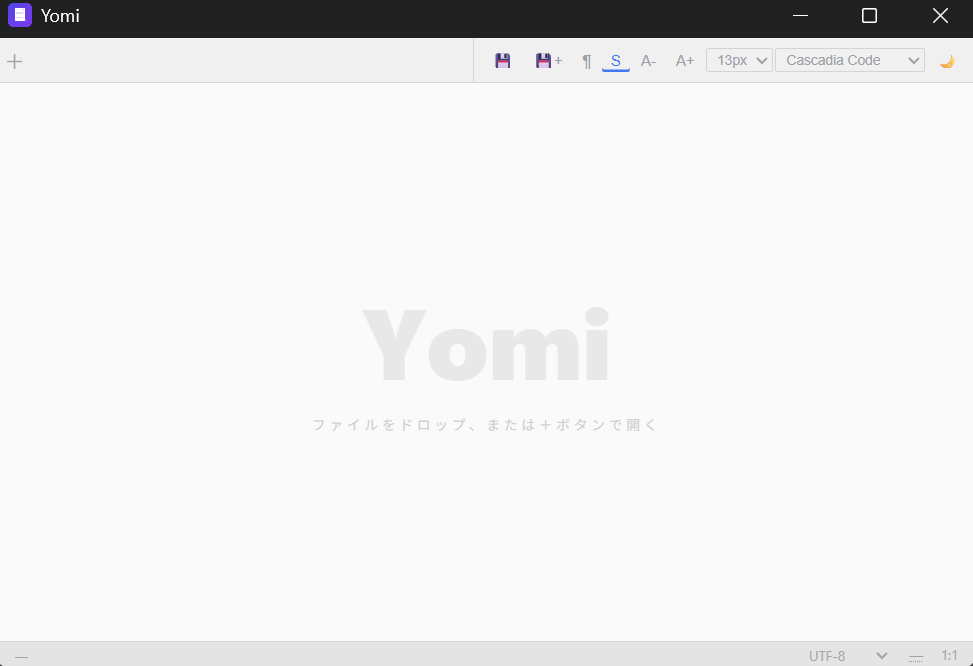

# Yomi

軽量テキストビューア。一瞬で開いて、気持ちよく読める。





## 特徴

- タブで複数ファイルを同時に開く
- シンタックスハイライト（JS / TS / Python / JSON / Markdown / CSS / HTML）
- 空白・タブ・改行コードの可視化
- 文字コード自動判定 + 切替（UTF-8 / Shift-JIS / EUC-JP / UTF-16）
- 改行コード変換（LF / CRLF / CR）
- フォント・文字サイズ変更
- ダーク / ライトテーマ
- ドラッグ＆ドロップでファイルを開く

## インストール（Windows）

[Releases](https://github.com/yuubuilds/yomi/releases) から `yomi_setup.exe` をダウンロードして実行してください。

> **Windows SmartScreen の警告が出た場合**
> コード署名なしの個人配布ツールのため、初回実行時に警告が出ることがあります。
> 「詳細情報」→「実行」をクリックすると続行できます。

## セットアップ（開発者向け）

### 必要なもの

- [Node.js](https://nodejs.org/) v18 以上

### セットアップ

```bash
git clone https://github.com/yuubuilds/yomi.git
cd yomi
npm install
npx @neutralinojs/neu update   # Neutralinojs バイナリをダウンロード
```

### 開発サーバー起動

```bash
npm run dev
```

### バイナリのビルド

```bash
npm run package
# → dist/yomi/ にバイナリが生成されます
```

### Windowsインストーラーのビルド

1. [Inno Setup](https://jrsoftware.org/isdl.php) をインストール
2. `npm run package` でバイナリを先にビルド
3. `installer/yomi_setup.iss` を Inno Setup で開く
4. `Build → Compile` を実行 → `installer/Output/yomi_setup.exe` が生成されます

## 技術スタック

- [Neutralinojs](https://neutralino.js.org/) — 軽量デスクトップアプリフレームワーク
- [CodeMirror 6](https://codemirror.net/) — エディタコンポーネント
- Vanilla JS / CSS

## License

[MIT](LICENSE)
